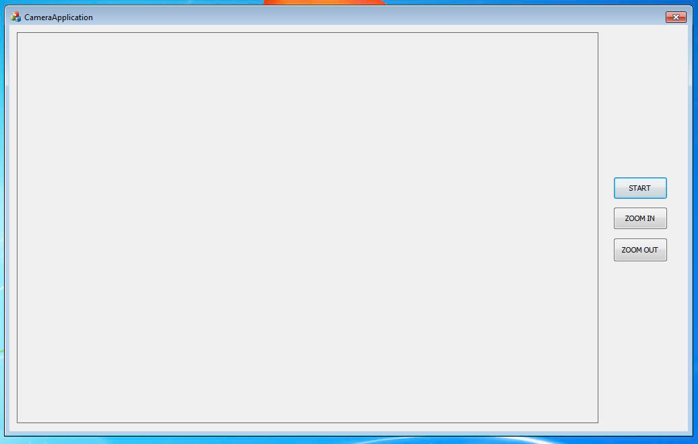

# CameraGUI (Built with C++ and MFC)

## Usage 

1. **Download** the `Release` folder from `CameraGUI/x64/Release` to your Windows 7 PC.

2. **Install Visual C++ Redistributable**:  
   Run `VC_redist.x64.exe` first to make sure all required dependencies are installed.

3. **Launch the application**:  
   Double-click on `CameraApplication.exe` to start the application.

 

 

- Click **START** to open the camera.

 

 

- Use **ZOOM IN** and **ZOOM OUT** buttons to adjust the zoom level.
- You can also **scroll the mouse wheel** to zoom in/out smoothly.

